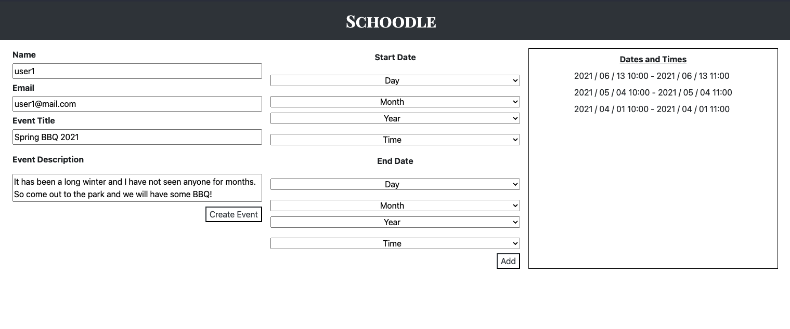
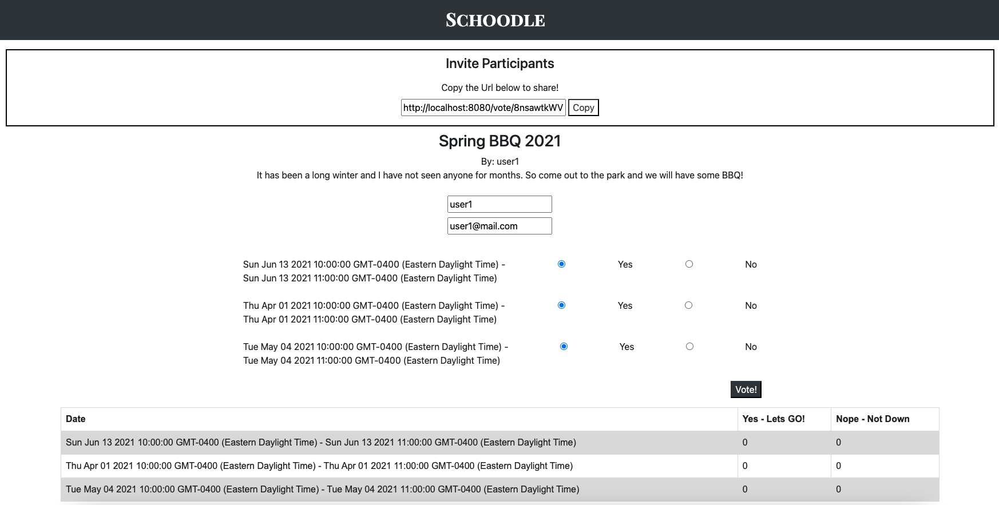

# Schnoodle !

### Plan your next event with Schnoodle!
 
Schnoodle removes the hassle of contacting each member of your party to sort which date and time aligns with everyones schedule. Simply create a poll and send it off!
 
Schnoodle allows the User Create, Edit, Share and Event with friends and family. This makes Schoodle an excepptionally useful Application for planning group gatherings, like a BBQ !

Schnoodle is a multi-page application built with JS, Node, JQuery, Ajax, SQL, Postgres, Express, HTML, and CSS !

# Jump In !
  1. Run the server: `npm run local`
  2. Visit `http://localhost:8080/events/new`

## Create an Event with 3 available options for voting

## Vote and Share an event with everyone

## Votes Update on Refresh. Each voter opening the shared link will have a visual of previous votes

This Project was built by [Gar Carey](https://github.com/GarCarey) and [Riaz](https://github.com/RiazCKhan)

 
 
 
========= Below are Node Skeleton Template Instructions my Partner and I used to get up and running. =========

 

### Project Setup

 
The following steps are only for _one_ of the group members to perform.

1. Create your own copy of this repo using the `Use This Template` button, ideally using the name of your project. The repo should be marked Public
2. Verify that the skeleton code now shows up in your repo on GitHub, you should be automatically redirected
3. Clone your copy of the repo to your dev machine
4. Add your team members as collaborators to the project so that they can push to this repo
5. Let your team members know the repo URL so that they use the same repo (they should _not_ create a copy/fork of this repo since that will add additional workflow complexity to the project)

### Getting Started

1. Create the `.env` by using `.env.example` as a reference: `cp .env.example .env`
2. Update the .env file with your correct local information 
  - username: `labber` 
  - password: `labber` 
  - database: `midterm`
3. Install dependencies: `npm i`
4. Fix to binaries for sass: `npm rebuild node-sass`
5. Reset database: `npm run db:reset`
  - Check the db folder to see what gets created and seeded in the SDB
7. Run the server: `npm run local`
  - Note: nodemon is used, so you should not have to restart your server
8. Visit `http://localhost:8080/`

### Warnings & Tips

- Do not edit the `layout.css` file directly, it is auto-generated by `layout.scss`
- Split routes into their own resource-based file names, as demonstrated with `users.js` and `widgets.js`
- Split database schema (table definitions) and seeds (inserts) into separate files, one per table. See `db` folder for pre-populated examples. 
- Use the `npm run db:reset` command each time there is a change to the database schema or seeds. 
  - It runs through each of the files, in order, and executes them against the database. 
  - Note: you will lose all newly created (test) data each time this is run, since the schema files will tend to `DROP` the tables and recreate them.

### Dependencies

- Node 10.x or above
- NPM 5.x or above
- PG 6.x
